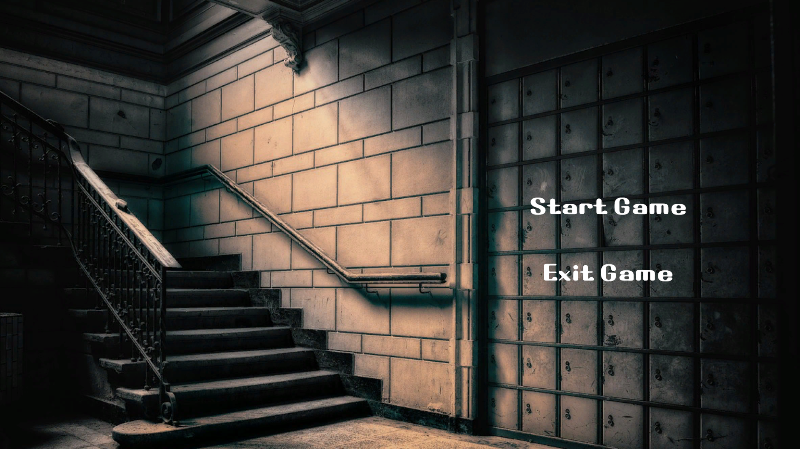
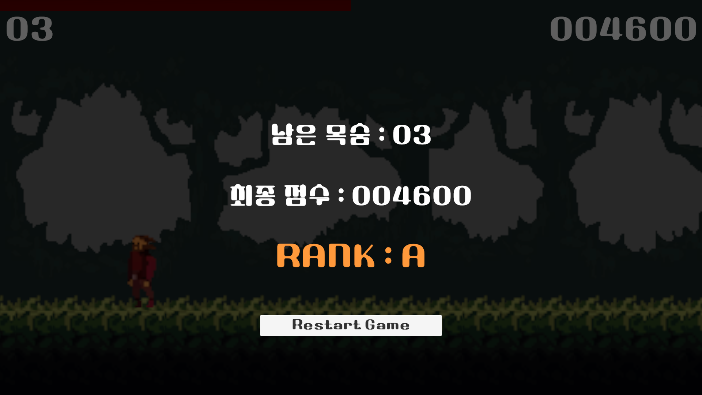
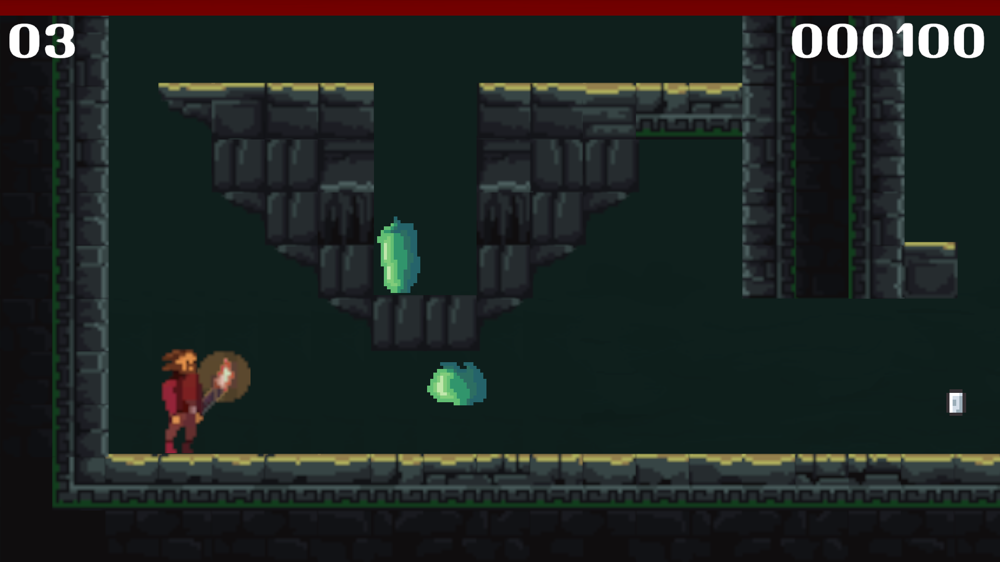
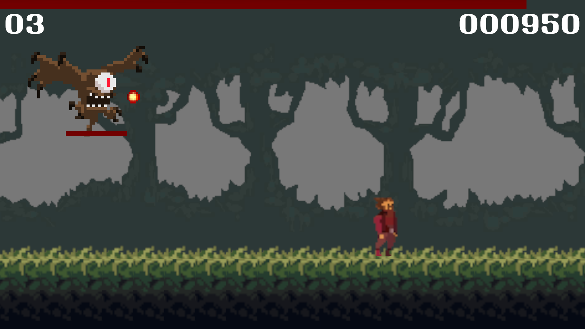

## 목차
- [개요](#개요)
- [게임 플레이 화면](#게임-플레이-화면)
- [게임 플레이 방식](#게임-플레이-방식)

  

## 개요
- 게임 장르 : 플랫포머, 러닝 액션 게임
- 개발 엔진 및 언어 : Unity, C#
- 개발 기간 : 2024.02.22-2024.03.05
- 개발 시간 : 21시간

  

## 게임 플레이 화면
|게임 시작 화면|게임 종료 화면|
|-|-|
|||

|레벨 1|레벨 2|
|-|-|
|||

  

## 게임 플레이 방식
||좌|우|점프|공격|무기 변경(Level 2 한정)|나가기|
|:-:|:-:|:-:|:-:|:-:|:-:|:-:|
|키보드|A|D|SPACE Bar|마우스 좌클릭|H|ESC|
|방향키|&larr;|&rarr;|-|-|-|-|
